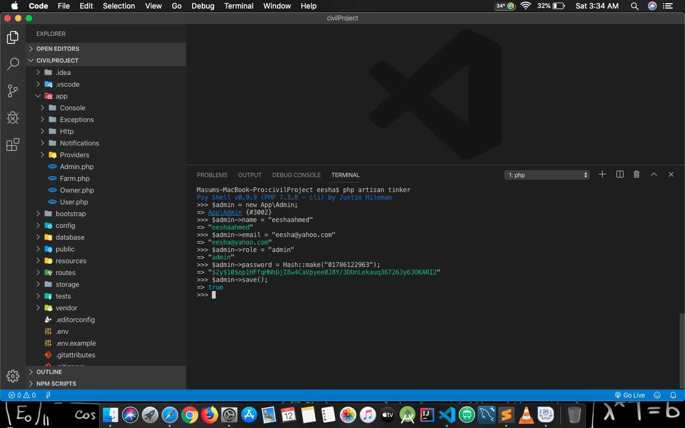

# Entrepreneur Project
<pre>
	Website Link : https://ouraloy.herokuapp.com
</pre>
This is really a dumy version.

## For laravel like this project, I prefer ATOM as developing tool with Atom-beautify, file-icons installed as extensions. Thank you

# Infos
<pre>
	eesha@gmail.com <br>
	01786122963
</pre>

### This is a kind of personal project. So maybe I will not provide so much information. :)

# Some Problems
Permission denied on storage/logs..

```javascript
1.
composer require unisharp/laravel-ckeditor

2.
Edit config/app.php, add the following file to Application Service Providers section.

Unisharp\Ckeditor\ServiceProvider::class,

3.
php artisan vendor:publish --tag=ckeditor

4.
Go to public file. Delete Storage frick.
Then
php artisan storage:link

5:
php artisan optimize:clear
if not working then
composer update

6:
php artisan serve

```
- For ckeditor : https://github.com/UniSharp/laravel-ckeditor
- But don't use this ckeditor. Just use the latest version CKEditor :)


## FOR FORM
```javascript
1. composer require "laravelcollective/html":"^5.4.0"
2.
  'providers' => [
    // ...
    Collective\Html\HtmlServiceProvider::class,
    // ...
  ],
3.
  'aliases' => [
    // ...
      'Form' => Collective\Html\FormFacade::class,
      'Html' => Collective\Html\HtmlFacade::class,
    // ...
  ],
4. https://laravelcollective.com/docs/5.4/html
5. php artisan make:migration create_projects_table --create=projects
6. php artisan make:model Projects -mcr  [migrattion, Controller, Resource]
7. php artisan migrate:rollback //if you want to change something in the table
8. php artisan migrate

```

## TINKER


## My vscode main 'user settings' look like this :
  ```javascript
      {
          "workbench.iconTheme": "material-icon-theme",
          "editor.suggestSelection": "first",
          "vsintellicode.modify.editor.suggestSelection": "automaticallyOverrodeDefaultValue",
          "files.autoSave": "afterDelay",
          "editor.fontSize": 15,
          "terminal.integrated.fontFamily": "Menlo, Monaco, 'Courier New', monospace",
          "editor.tabSize": 42,
          "editor.fontFamily": "Menlo, Monaco, 'Consolas', monospace",
          "dart.flutterSdkPath": "/Volumes/TASKS/Documents/DEV/flutter/flutter",
          "terminal.integrated.shell.osx": "/bin/bash",
          "[javascript]": {
              "editor.defaultFormatter": "esbenp.prettier-vscode"
          },
          "[html]": {
              "editor.defaultFormatter": "esbenp.prettier-vscode"
          },
          "[jsonc]": {
              "editor.defaultFormatter": "esbenp.prettier-vscode"
          },
          "python.jediEnabled": false,
          "files.exclude": {
              "**/.classpath": true,
              "**/.project": true,
              "**/.settings": true,
              "**/.factorypath": true
          },
          "java.errors.incompleteClasspath.severity": "ignore",
          "dart.debugExternalLibraries": true,
          "dart.debugSdkLibraries": false,
          "liveServer.settings.donotVerifyTags": true,
          "liveServer.settings.donotShowInfoMsg": true,
          "[cpp]": {
              "editor.defaultFormatter": "ms-vscode.cpptools"
          },
          "blade.format.enable": true,
          "[php]": {
              "editor.defaultFormatter": "esbenp.prettier-vscode"
          }
      }
```

## My project settings [.vscode > settings.json]
  ```javascript
    {
        "git.ignoreLimitWarning": true,
        "beautify.language": {
            "html": ["blade", "html"]
        }
    }
  ```


## For 'PHP with prettier'
- run the command (with sudo bash window) . This will globally install prettier.
  npm install --global prettier @prettier/plugin-php
  But globally it will not work.. SO you have to run it locally.
  npm install --save-dev prettier @prettier/plugin-php (this is right)
- To check if it's working or not?
  prettier bad.php (add --write to write in main file)

    ```javascript
      <?php
    namespace Foobar;
        class SomeClass    {
                public   function getCallbacks() {
                return        array( function () {return $this->firstName;},
                function () {
                    return $this->callSomeMethod('foo')->andThenOtherMethod( Bar::withSome("arguments"),
                        $andHELL                );
    });
    }}
    ```
- .vscode > settings.json [project settings]
  or update such things on main user settings :) [Above]
```javascript
    {
      "[php]":{
          "editor.defaultFormatter": "esbenp.prettier-vscode"
      }
    }
    ```
- Now format any php with [Format Document with prettier]


## Main user settings look like


## For blade formatting
- Install 'Laravel Blade Snippets' and
  on user setting of 'Laravel Blade Snippet'.. Enable 'Formatting'. [Deprecated]
- [Valid] Install 'Beautify' which can be used for formatting, and added these lines into 'project settings',
  ```javascript
  {
    "beautify.language": {
      "html": [
          "blade",
          "html"
      ]
    }
  }

  ```
